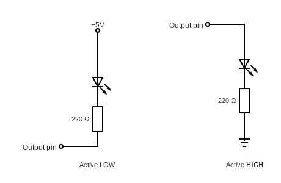
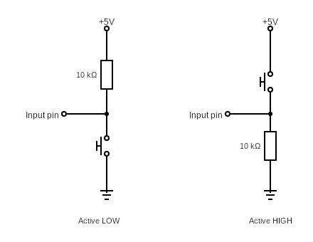

# Lab 2: Matyáš Sedláček

Link to your `Digital-electronics-2` GitHub repository:

   [https://github.com/SedlacekMat/Digital-electronics-2/tree/main/Labs/02-leds](https://github.com/SedlacekMat/Digital-electronics-2/tree/main/Labs/02-leds)


## Preparation tasks (done before the lab at home)

1. Draw two basic ways to connect a LED to the output pin of the microcontroller: LED active-low, LED active-high.

&nbsp;



&nbsp;

2. [Calculate LED resistor value](https://electronicsclub.info/leds.htm) for typical red and blue LEDs.

&nbsp;

&nbsp;

| **LED color** | **Supply voltage** | **LED current** | **LED voltage** | **Resistor value** |
| :-: | :-: | :-: | :-: | :-: |
| red | 5&nbsp;V | 20&nbsp;mA | 2&nbsp;V | 150&nbsp;Ω |
| blue | 5&nbsp;V | 20&nbsp;mA | 3&nbsp;V | 100&nbsp;Ω |


3. Draw the basic ways to connect a push button to the microcontroller input pin: button active-low, button active-high.

&nbsp;



&nbsp;


### Active-low and active-high LEDs

1. Complete tables according to the AVR manual.

| **DDRB** | **Description** |
| :-: | :-- |
| 0 | Input pin |
| 1 | Output pin |

| **PORTB** | **Description** |
| :-: | :-- |
| 0 | Output low value |
| 1 | Output high value |

| **DDRB** | **PORTB** | **Direction** | **Internal pull-up resistor** | **Description** |
| :-: | :-: | :-: | :-: | :-- |
| 0 | 0 | input | no | Tri-state, high-impedance |
| 0 | 1 | input | yes | Tri-state, high-impedance |
| 1 | 0 | output | no | Output Low (sink) |
| 1 | 1 | output | no | Output High (source)|

2. Part of the C code listing with syntax highlighting, which blinks alternately with a pair of LEDs; let one LED is connected to port B and the other to port C:

```c
int main(void)
{
    // Green LED at port B
    // Set pin as output in Data Direction Register...
    	DDRB = DDRB | (1<<LED_GREEN);
    // ...and turn LED off in Data Register
    	PORTB = PORTB & ~(1<<LED_GREEN);

    // Configure the second LED at port C
	DDRC= DDRC | (1<<LED_RED);
	PORTC = PORTC |=(1<<LED_RED);


    // Configure Push button at port D and enable internal pull-up resistor

    // Infinite loop
    while (1)
    {	
		_delay_ms(BLINK_DELAY);

        	PORTB = PORTB |=(1<<LED_GREEN); //led green high
		PORTC = PORTC |=(1<<LED_RED);
		
		_delay_ms(BLINK_DELAY);
		
		PORTB = PORTB & ~(1<<LED_GREEN); //led green low
		PORTC = PORTC & ~(1<<LED_RED);

    }

    // Will never reach this
    return 0;
}
```


### Push button

1. Part of the C code listing with syntax highlighting, which toggles LEDs only if push button is pressed. Otherwise, the value of the LEDs does not change. Let the push button is connected to port D:

```c
    // Configure Push button at port D and enable internal pull-up resistor
    int main(void)
{
    // Green LED at port B
    // Set pin as output in Data Direction Register...
    	DDRB = DDRB | (1<<LED_GREEN);
    // ...and turn LED off in Data Register
    	PORTB = PORTB & ~(1<<LED_GREEN);

    // Configure the second LED at port C
	DDRC= DDRC | (1<<LED_RED);
	PORTC = PORTC |=(1<<LED_RED);

	DDRD= DDRD & ~(1<<PUSH_BUTT);
	PORTD = PORTD |=(1<<PUSH_BUTT);

    // Configure Push button at port D and enable internal pull-up resistor

    // Infinite loop
    while (1)
    {
        if (bit_is_clear(PIND, 7)) 
		{
		_delay_ms(BLINK_DELAY);

        	PORTB = PORTB |=(1<<LED_GREEN); //led green high
		PORTC = PORTC |=(1<<LED_RED);
		
		_delay_ms(BLINK_DELAY);
		
		PORTB = PORTB & ~(1<<LED_GREEN); //led green low
		PORTC = PORTC & ~(1<<LED_RED);
		}

    }

    // Will never reach this
    return 0;
}
```


### Knight Rider

1. Scheme of Knight Rider application, i.e. connection of AVR device, five LEDs, resistors, one push button, and supply voltage. The image can be drawn on a computer or by hand. Always name all components and their values!

   
